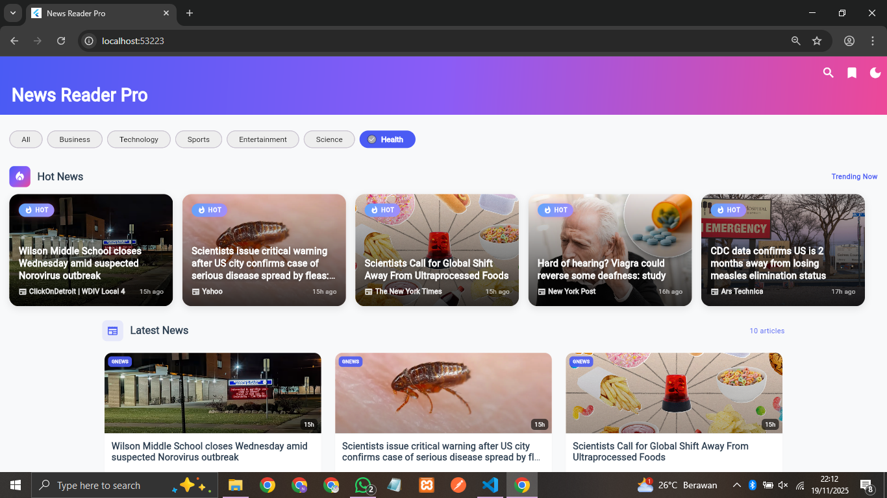
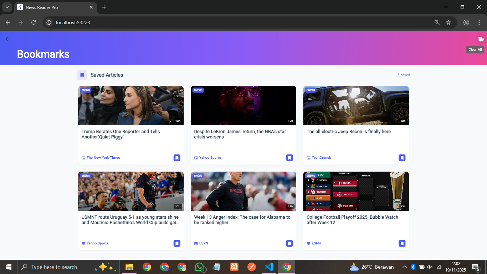
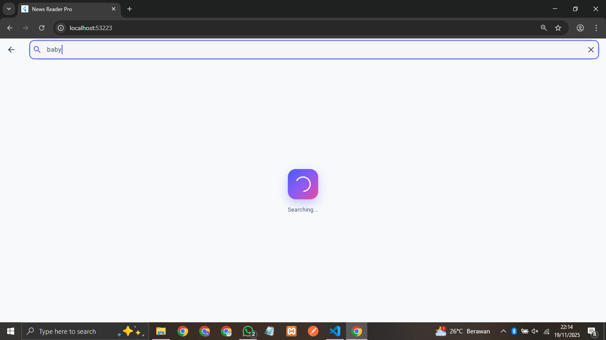

# 📰 News Reader Pro


A premium Flutter news application that aggregates news from multiple trusted sources with a beautiful, responsive UI and offline support.

## ✨ Features

### Core Features
- 📱 **Multi-Source News Aggregation** - 5 API sources (GNews, NewsAPI, Currents, NewsData, Mediastack)
- 🔍 **Smart Search** - Search across all news sources
- 📂 **Category Filtering** - 7 news categories
- 🔖 **Bookmark System** - Save articles with persistent storage
- 🌙 **Dark/Light Mode** - Cosmic theme with smooth transitions
- 📤 **Share Articles** - Share via WhatsApp, Email, Social Media
- 📶 **Offline Reading** - Cached articles available offline
- 🔄 **Pull to Refresh** - Stay updated with latest news
- ⚡ **Error Handling** - Automatic fallback between APIs

### UI/UX Features
- 📊 **Responsive Grid Layout** - 1-3 columns based on screen size (4:3 ratio)
- 🔥 **Hot News Section** - Featured trending articles
- 🎨 **Glassmorphism Design** - Modern gradient effects
- ✨ **Smooth Animations** - Fade, scale, and slide transitions
- 📍 **Sticky Navigation** - AppBar stays visible while scrolling
- 🦶 **Professional Footer** - Complete with API attribution

## 🚀 Getting Started

### Prerequisites

- Flutter SDK (3.0.0 or higher)
- Dart SDK (2.19.0 or higher)
- Android Studio / VS Code
- An Android device or emulator / iOS device or simulator

### Installation

1. **Clone the repository**
   ```bash
   git clone https://github.com/Nzieraaa/news_reader_pro.git
   cd news_reader_pro
   ```

2. **Install dependencies**
   ```bash
   flutter pub get
   ```

3. **Run the app**
   ```bash
   flutter run
   ```

## 🔑 API Keys Configuration

This app uses 5 news APIs. API keys are already included for demo purposes:

### Configured APIs:
1. **GNews API** - `c162ee64d3d842a9dd66aefe426504ec`
2. **NewsAPI.org** - `dcd530d9f04c4d39adf527c04d3a2d59`
3. **Currents API** - `1f4kxFWKUMBcuAHALrJca9iRdPAjTHETMwdA5i45xID1-6dw`
4. **NewsData.io** - `pub_8a4f8a1c8007448a921d3ede61e0f00b`
5. **Mediastack API** - `119c11c2febc783f983f1dd7faefb235`

### To use your own API keys:

1. Get free API keys from:
   - [GNews](https://gnews.io/)
   - [NewsAPI.org](https://newsapi.org/)
   - [Currents API](https://currentsapi.services/)
   - [NewsData.io](https://newsdata.io/)
   - [Mediastack](https://mediastack.com/)

2. Update `lib/core/constants/api_constants.dart`:
   ```dart
   static const String gnewsApiKey = 'YOUR_GNEWS_KEY';
   static const String newsApiKey = 'YOUR_NEWSAPI_KEY';
   // ... etc
   ```

## 🏗️ Architecture

This app follows **Clean Architecture** principles with **MVVM pattern**:

```
lib/
├── core/
│   ├── constants/      # API keys, app constants
│   ├── exceptions/     # Custom exception classes
│   └── theme/          # App theme (Cosmic Blue-Purple-Pink)
├── data/
│   ├── models/         # NewsArticle, NewsResponse models
│   ├── datasources/    # API service (5 APIs with fallback)
│   └── repositories/   # Repository implementation
├── domain/
│   └── repositories/   # Repository interface
└── presentation/
    ├── providers/      # State management (Provider)
    ├── screens/        # UI screens (Home, Detail, Search, Bookmarks)
    └── widgets/        # Reusable widgets (Cards, Loading, etc)
```

## 📦 Dependencies

### Core Dependencies
```yaml
provider: ^6.1.1              # State management
http: ^1.1.0                  # API requests
dio: ^5.4.0                   # Advanced HTTP client

### UI Dependencies
cached_network_image: ^3.3.0  # Image caching
shimmer: ^3.0.0               # Loading animations
pull_to_refresh: ^2.0.0       # Pull to refresh

### Storage
shared_preferences: ^2.2.2    # Local storage for bookmarks
sqflite: ^2.3.0               # SQLite database
path_provider: ^2.1.1         # File system paths

### Utilities
intl: ^0.18.1                 # Date formatting
url_launcher: ^6.2.1          # Open URLs
share_plus: ^7.2.1            # Share functionality
connectivity_plus: ^5.0.2     # Network status
```

## 📱 Screenshots

### Light Mode
- Home Screen (Grid Layout with Hot News)

- Search Results

- Article Detail

- Bookmarks


### Dark Mode
- All screens with dark theme

- Smooth transitions

- Gradient effects


## 🎨 Theme

**Cosmic Theme** - Blue, Purple, Pink gradient
- Primary: `#4A5BF4` (Deep Blue)
- Secondary: `#8B5CF6` (Violet)
- Accent: `#EC4899` (Pink)

## 🧪 Testing

Run tests:
```bash
flutter test
```

## 📊 Performance

- **Fast Loading**: Parallel API calls with caching
- **Offline Support**: Articles cached for offline reading
- **Responsive**: Adapts to mobile, tablet, and desktop
- **Optimized Images**: Cached network images with placeholders

## 🐛 Known Issues

- Web share API has limited options (use native platforms for full share menu)
- Some API sources may have rate limits on free tier

## 🔮 Future Enhancements

- [ ] Localization (Multi-language support)
- [ ] Unit & Integration Tests
- [ ] Article recommendations based on reading history
- [ ] Push notifications for breaking news
- [ ] Text-to-Speech for articles

## 📄 License

This project is licensed under the MIT License - see the LICENSE file for details.

## 👨‍💻 Author

**Nzieraaa**
- Email: nancy.akisya.n@gmail.com
- GitHub: [@Nzieraaa](https://github.com/Nzieraaa)

## 🙏 Acknowledgments

- Flutter Team for the amazing framework
- News API providers: GNews, NewsAPI, Currents, NewsData, Mediastack
- Icon resources: Lucide Icons
- UI inspiration: Modern news apps

## 📞 Support

For issues and questions:
- 📧 Email: nancy.akisya.n@gmail.com
- 🐛 Issues: [GitHub Issues](https://github.com/Nzieraaa/news_reader_pro/issues)

---

Made with ❤️ using Flutter

**Last Updated**: 20 November 2025
